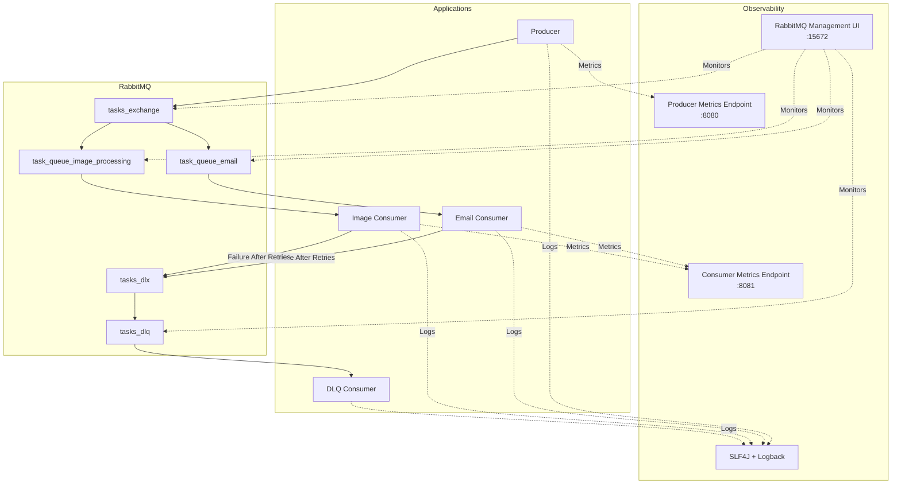

```mermaid
flowchart TB

    subgraph Applications

        P[Producer]

        EC[Email Consumer]

        IC[Image Consumer]

        DLC[DLQ Consumer]

    end

    subgraph RabbitMQ

        EX[tasks_exchange]

        EQ[task_queue_email]

        IQ[task_queue_image_processing]

        DLX[tasks_dlx]

        DLQ[tasks_dlq]

    end

    P --> EX

    EX --> EQ
    EX --> IQ

    EQ --> EC
    IQ --> IC

    EC -->|Failure After Retries| DLX
    IC -->|Failure After Retries| DLX

    DLX --> DLQ

    DLQ --> DLC

    subgraph Observability

        LOGS[SLF4J + Logback]

        UI[RabbitMQ Management UI<br/>:15672]

        PM[Producer Metrics Endpoint<br/>:8080]

        CM[Consumer Metrics Endpoint<br/>:8081]

    end

    P -. Logs .-> LOGS
    EC -. Logs .-> LOGS
    IC -. Logs .-> LOGS
    DLC -. Logs .-> LOGS

    P -. Metrics .-> PM

    EC -. Metrics .-> CM
    IC -. Metrics .-> CM

    UI -. Monitors .-> EX
    UI -. Monitors .-> EQ
    UI -. Monitors .-> IQ
    UI -. Monitors .-> DLQ
```