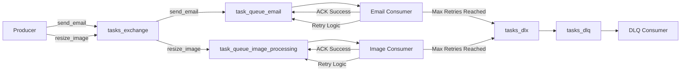

```mermaid
flowchart LR

    P[Producer]

    EX[tasks_exchange]

    EQ[task_queue_email]
    IQ[task_queue_image_processing]

    C1[Email Consumer]
    C2[Image Consumer]

    DLX[tasks_dlx]
    DLQ[tasks_dlq]

    DLC[DLQ Consumer]

    P -->|send_email| EX
    P -->|resize_image| EX

    EX -->|send_email| EQ
    EX -->|resize_image| IQ

    EQ --> C1
    IQ --> C2

    C1 -->|ACK Success| EQ
    C2 -->|ACK Success| IQ

    C1 -->|Retry Logic| EQ
    C2 -->|Retry Logic| IQ

    C1 -->|Max Retries Reached| DLX
    C2 -->|Max Retries Reached| DLX

    DLX --> DLQ

    DLQ --> DLC
```