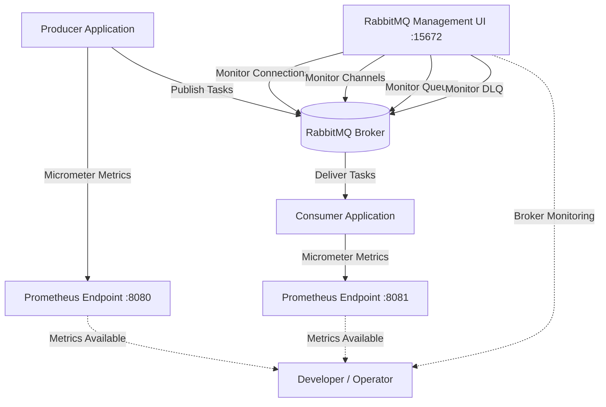

```mermaid
flowchart TB

    P[Producer Application]
    C[Consumer Application]

    P -->|Micrometer Metrics| PM[Prometheus Endpoint :8080]
    C -->|Micrometer Metrics| CM[Prometheus Endpoint :8081]

    RUI[RabbitMQ Management UI :15672]

    R[(RabbitMQ Broker)]

    P -->|Publish Tasks| R
    R -->|Deliver Tasks| C

    RUI -->|Monitor Connections| R
    RUI -->|Monitor Channels| R
    RUI -->|Monitor Queues| R
    RUI -->|Monitor DLQ| R

    PM -.->|Metrics Available| DEV[Developer / Operator]
    CM -.->|Metrics Available| DEV

    RUI -.->|Broker Monitoring| DEV
```