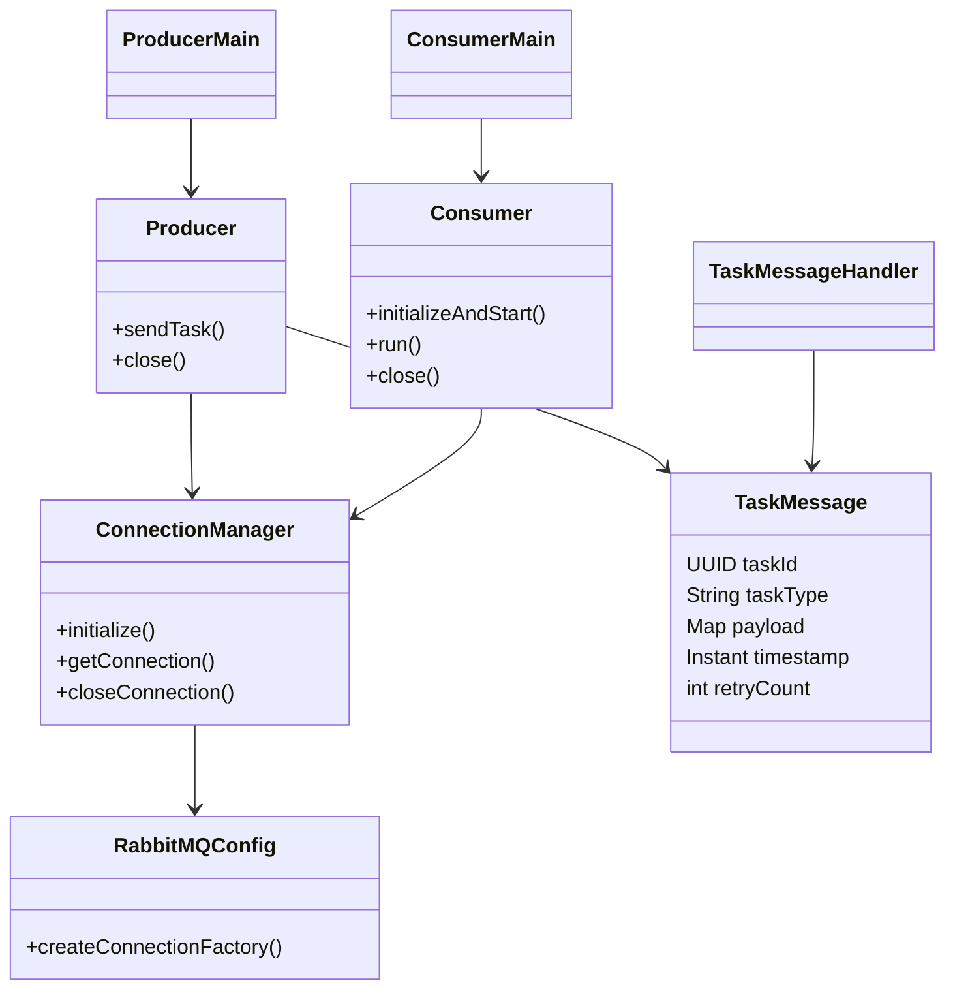

```mermaid
classDiagram

    class ConnectionManager {
        +initialize()
        +getConnection()
        +closeConnection()
    }

    class RabbitMQConfig {
        +createConnectionFactory()
    }

    class TaskMessage {
        UUID taskId
        String taskType
        Map payload
        Instant timestamp
        int retryCount
    }

    class Producer {
        +sendTask()
        +close()
    }

    class ProducerMain

    class Consumer {
        +initializeAndStart()
        +run()
        +close()
    }

    class TaskMessageHandler

    class ConsumerMain

    Producer --> ConnectionManager
    Consumer --> ConnectionManager

    Producer --> TaskMessage

    TaskMessageHandler --> TaskMessage

    ProducerMain --> Producer

    ConsumerMain --> Consumer

    ConnectionManager --> RabbitMQConfig
```