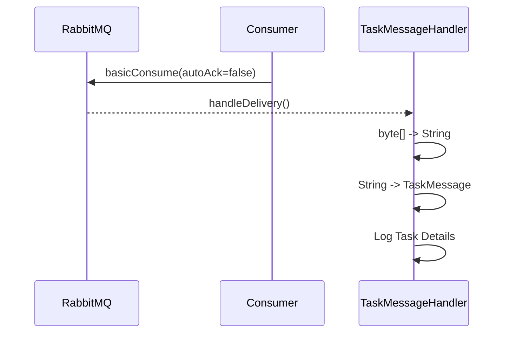

```mermaid
sequenceDiagram

    participant RMQ as RabbitMQ
    participant C as Consumer
    participant H as TaskMessageHandler

    C->>RMQ: basicConsume(autoAck=false)

    RMQ-->>H: handleDelivery()

    H->>H: byte[] -> String

    H->>H: String -> TaskMessage

    H->>H: Log Task Details

```