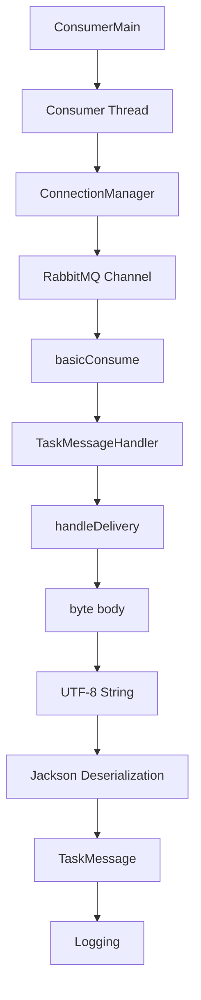

```mermaid
flowchart TD

    A[ConsumerMain]

    B[Consumer Thread]

    C[ConnectionManager]

    D[RabbitMQ Channel]

    E[basicConsume]

    F[TaskMessageHandler]

    G[handleDelivery]

    H[byte body]

    I[UTF-8 String]

    J[Jackson Deserialization]

    K[TaskMessage]

    L[Logging]

    A --> B
    B --> C
    C --> D
    D --> E
    E --> F
    F --> G
    G --> H
    H --> I
    I --> J
    J --> K
    K --> L
```