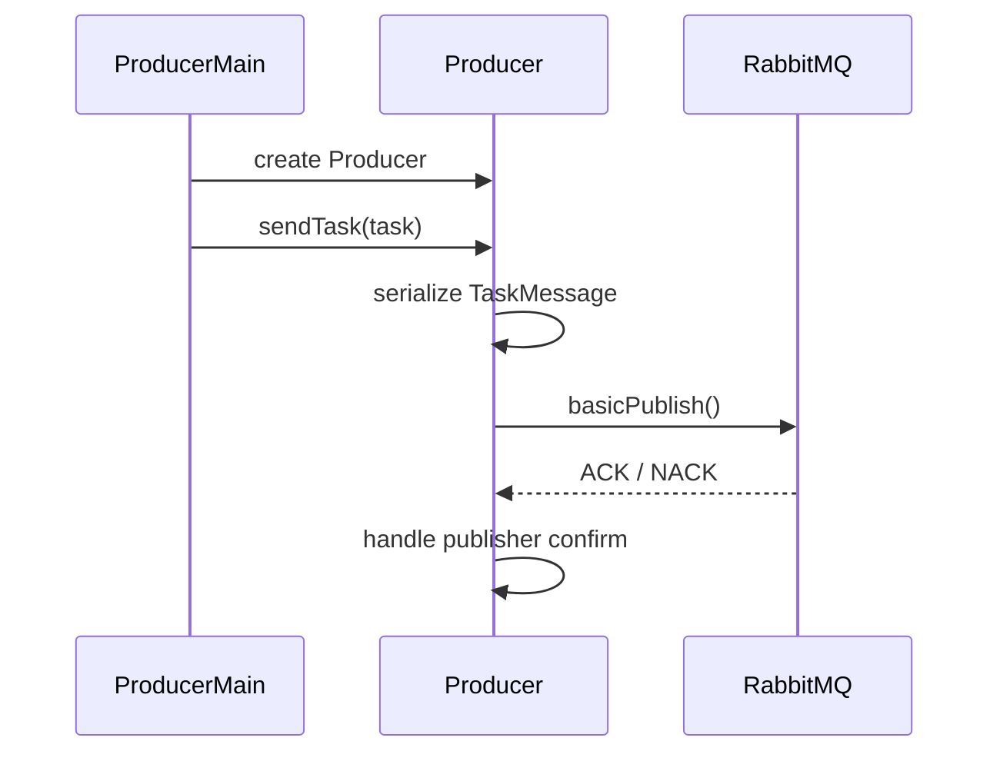

```mermaid
sequenceDiagram

    participant PM as ProducerMain
    participant P as Producer
    participant RMQ as RabbitMQ

    PM->>P: create Producer

    PM->>P: sendTask(task)

    P->>P: serialize TaskMessage

    P->>RMQ: basicPublish()

    RMQ-->>P: ACK / NACK

    P->>P: handle publisher confirm
```