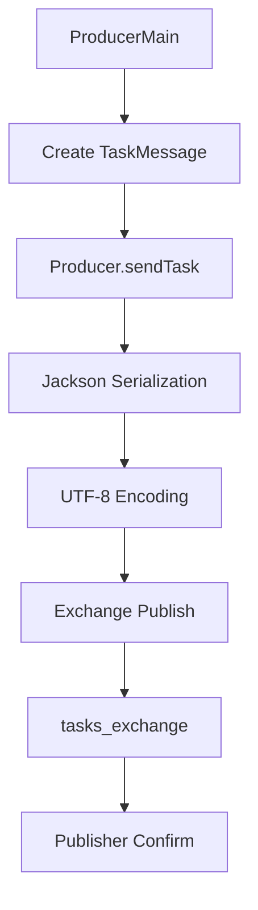

```mermaid
flowchart TD

    A[ProducerMain]

    B[Create TaskMessage]

    C[Producer.sendTask]

    D[Jackson Serialization]

    E[UTF-8 Encoding]

    F[Exchange Publish]

    G[tasks_exchange]

    H[Publisher Confirm]

    A --> B
    B --> C
    C --> D
    D --> E
    E --> F
    F --> G
    G --> H
```