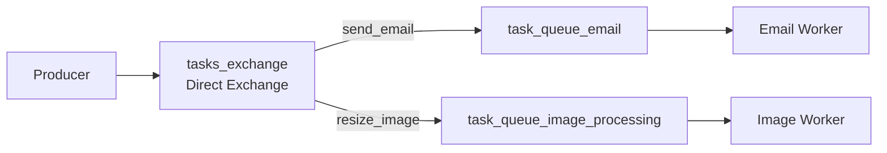
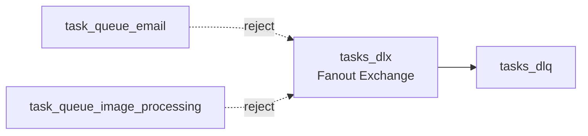
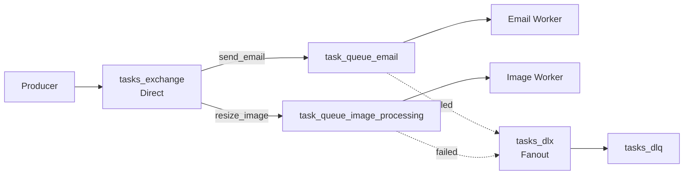

# RabbitMQ Topology

## Core Components

| Component | Value |
|------------|---------|
| VHost | `task_queue_vhost` |
| User | `task_user` |
| Main Exchange | `tasks_exchange (Direct)` |
| DLX | `tasks_dlx (Fanout)` |
| DLQ | `tasks_dlq` |

---

## RabbitMQ Topology

---

## Dead Letter Flow

---

## Complete Flow

---

## Design Decisions

| Choice | Reason |
|----------|----------|
| Direct Exchange | Exact routing by task type |
| Multiple Queues | Independent scaling and isolation |
| Fanout DLX | Route all failed messages to one place |
| DLQ | Preserve failed tasks for investigation |
| Dedicated VHost | Resource isolation |
